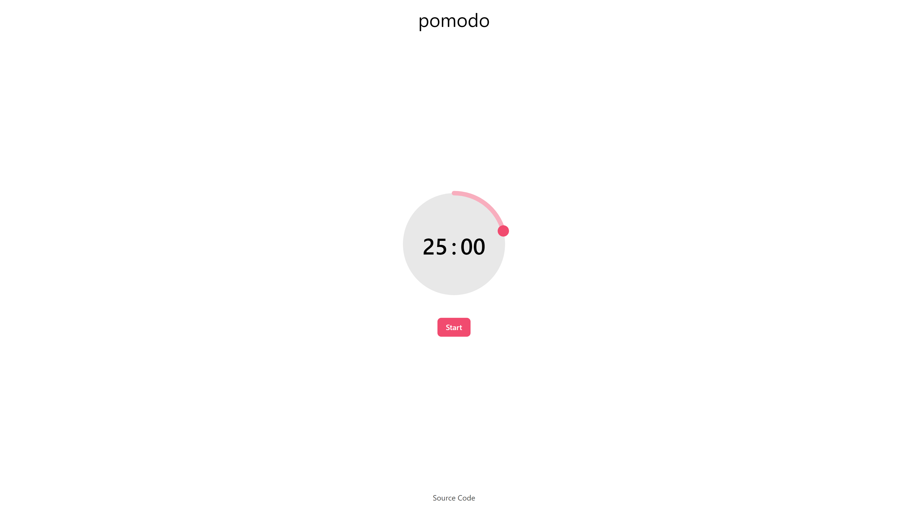

# Pomodo



_More screenshots are available [here](screenshots/)_

## Features

- Minimalist interface without distractions
- Supports notifications
- Has both light and dark mode
- Works offline (as a PWA)
- Accessible

## Development

### Prerequisites

- Node.js and npm

### Setup

1. Clone the repository

```bash
git clone https://github.com/ivteplo/pomodo
```

2. Navigate to the project folder

```bash
cd pomodo
```

3. Install dependencies

```bash
npm install
# or if you prefer yarn:
yarn install
```

4. To start a development server:

```bash
npm run dev
# or
yarn dev
```

5. To build the project:

```bash
npm run build
# or
yarn build
```

6. Happy hacking! 🎉
